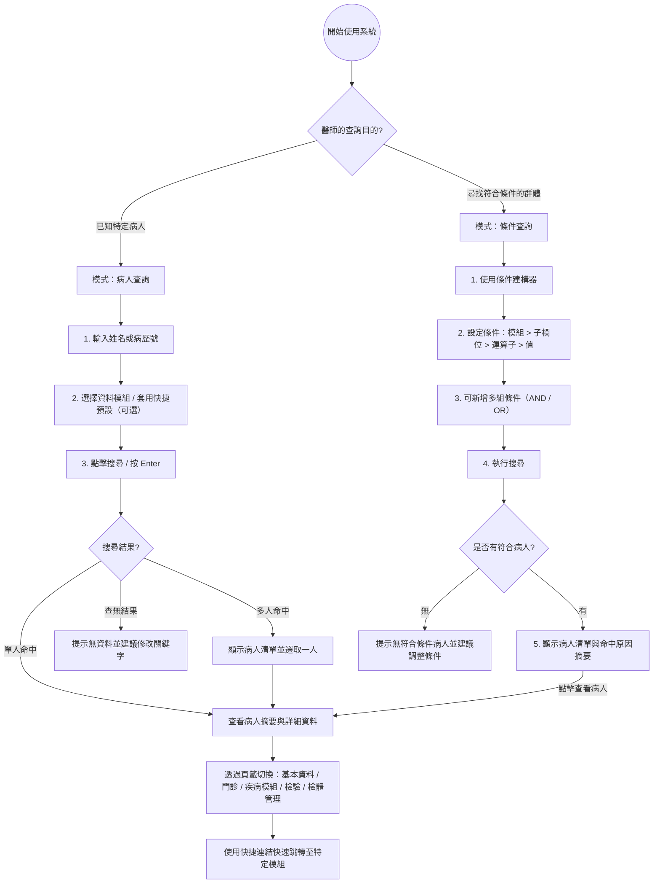

# 基因醫學整合查詢中心規格（給 Lovable / v0.dev）

## 1. 專案目標

請設計一個 **桌面優先（desktop-first）** 的醫療內部系統查詢頁面，使用者是 **基因醫學 / 先天代謝異常 / 罕見疾病相關醫師**。

這個頁面不是單純的病人搜尋，也不是單一檢驗報告頁，而是：

> **病人主索引 + 疾病模組 + 檢驗模組 + 門診追蹤 + 檢體管理** 的整合查詢中心

頁面需要支援兩種查詢方式：

1. **病人查詢**：輸入病人姓名或病歷號，查看單一病人的完整資料
2. **條件查詢**：選擇模組、子欄位、條件與值，列出符合條件的病人清單

設計重點：
- 讓醫師可以快速找到單一病人
- 也可以依檢驗值、診斷、日期、模組條件找出一群病人
- 從條件查詢結果可快速切換到單一病人的詳細頁面
- 整體介面要高資訊密度、低學習成本、快速掃描

---

## 2. 產品決策：不要拆成兩個完全獨立頁面

### 建議方案
請設計成 **同一個查詢中心頁面，提供兩種查詢模式切換**，而不是兩個完全分離的頁面。

### 原因
這兩種需求本質上是同一個臨床工作流程：

1. 先找單一病人，看完整資料
2. 或先用條件找出一批病人，再點進個別病人檢視詳情

若拆成兩頁，醫師會一直切換頁面、重新理解介面、重選條件，增加認知負擔。

### UI 建議
請在頁面頂部使用明確的模式切換元件，例如：
- segmented control
- tabs
- pill switch

兩個模式名稱請使用：
- **病人查詢**
- **條件查詢**

---

## 3. 使用者與情境

### 主要使用者
- 基因醫學醫師
- 代謝科醫師
- 罕病個案追蹤醫師
- 研究助理 / 個管師（次要）

### 主要情境 A：病人查詢
1. 醫師已知病人姓名或病歷號
2. 快速查到病人
3. 查看病人基本資料、門診、檢驗、DNA 樣本、外送檢體等整體資訊

### 主要情境 B：條件查詢
1. 醫師不知道病人是誰，但知道條件
2. 例如想找：
   - Biomarker 異常的病人
   - Citr 偏低的病人
   - 診斷包含 MPS 的病人
   - 某時間區間有外送檢體的病人
3. 系統列出符合條件的病人清單
4. 醫師再點入單一病人查看完整資料

---

## 4. 頁面核心理念

請把這個頁面理解為：

> **一個查詢中心，兩種入口，共用同一套模組字典、欄位說明與病人詳情視圖**

設計原則：
- **先切換查詢模式，再輸入條件**
- **先看摘要，再看明細**
- **以模組分群取代一長串縮寫**
- **讓醫師一眼知道這是在查哪一類資料**
- **條件查詢結果必須能快速跳到單一病人詳情**

---

### 醫師快速理解流程圖（Mermaid）

這張流程圖是給醫師、產品、設計與前端快速理解整體查詢邏輯使用。  
重點是：**同一個查詢中心有兩種入口，但最後都會進到同一個病人詳情視圖**。

## 5. 資訊架構（Information Architecture）

請將資料模組分成 4 大群，而不是平鋪所有縮寫。

### A. 病人資料
- 基本資料
- OPD（門診紀錄）

### B. 疾病 / 專案模組
- AADC
- ALD
- MMA
- MPS / 相關 target panel（原本資料來源名稱可能是 MPS2）

### C. 檢驗模組
- AA（胺基酸分析）
- MS/MS（串聯質譜篩檢）
- Biomarker（溶小體疾病生物標記）
- LSD panel（多重溶小體酵素 panel）
- Enzyme（酵素檢驗）
- GAG（糖胺聚醣定量）

### D. 檢體 / 樣本管理
- DNAbank
- Outbank（外送檢體 / 外部送驗）

---

## 6. 模組臨床意義（UI 必須顯示友善名稱與說明）

請不要只顯示縮寫，請顯示「縮寫 + 中文說明」，並提供 tooltip 或說明文字。

| 模組代碼 | 建議顯示名稱 | 醫師可理解的說明 |
|---|---|---|
| 基本資料 | 基本資料 | 病歷號、生日、性別、診斷等病人主檔資料 |
| OPD | 門診紀錄 | 看診日、主診斷碼、主診斷名稱、次診斷等門診追蹤資料 |
| AA | 胺基酸分析（AA） | 查胺基酸檢驗結果與個別 analyte 數值，如 Gln、Citr |
| MS/MS | 串聯質譜篩檢（MS/MS） | 查 MS/MS 篩檢結果與個別 analyte 資料，如 Ala、Arg、Cit |
| Biomarker | 生物標記（Biomarker） | 查 DBS / Plasma biomarker，如 LysoGb3、LysoGL1、Lyso-SM |
| AADC | AADC 相關檢測 | 查 AADC 模組樣本與濃度結果 |
| ALD | ALD 相關檢測 | 查 ALD 模組樣本與濃度結果 |
| MMA | MMA 相關檢測 | 查 MMA 模組樣本與濃度結果 |
| MPS2 | MPS / 相關 target panel | 名稱雖為 MPS2，但實際可能包含 MPS2、MPS4A、MPS6、TPP1 等 target |
| LSD | LSD 多重酵素 panel | 查 GAA、GLA、ABG、IDUA 等 lysosomal storage disease panel |
| Enzyme | 酵素檢驗 | 查酵素活性、檢體類別、技術人員與結果 |
| GAG | GAG 定量 | 查 GAG、Creatinine 及相關結果，用於 MPS 相關評估 |
| DNAbank | DNA 檢體庫 | 查 DNA 樣本編號、樣本類型、備註與管理資訊 |
| Outbank | 外送檢體 | 查外送檢體編號、送驗日期、assay 與結果 |

---

## 7. 已知子欄位（請反映在搜尋與結果設計中）

### AA
- AA_Sample_name
- AA-檢體類別
- AA-Result
- AA-Gln
- AA-Citr
- 以及其他 amino acid analytes

### Biomarker
- Biomarker_Sample_name
- DBS LysoGb3
- DBS LysoGL1
- DBS Lyso-SM
- Plasma LysoGb3
- Plasma LysoGL1
- 以及其他 biomarker 欄位

### AADC
- AADC_Sample_name
- AADC_Conc

### ALD
- ALD_Sample_name
- ALD_Conc

### DNAbank
- DNA-orderno
- DNA-order
- DNA-order_memo
- DNA-keyword
- DNA-specimenno
- DNA-specimen
- 以及其他 DNA 檢體管理欄位

### 基本資料
- chartno_out
- birthday
- sex
- diagnosis
- diagnosis2
- diagnosis3

### MPS2
- MPS2_Sample_name
- MPS2
- TPP1
- MPS4A
- MPS6

### LSD
- LSD_Sample_name
- GAA
- GLA
- ABG
- IDUA
- ABG/GAA

### MMA
- MMA_Sample_name
- MMA_Conc

### MS/MS
- MS/MS_Sample_name
- MS/MS-檢體類別
- MS/MS-Result
- Ala
- Arg
- Cit
- 以及其他 analytes

### OPD
- 看診日
- 性別
- 生日
- 主診斷碼
- 主診斷名稱
- 次診斷名稱1
- 以及其他門診相關欄位

### Enzyme
- Enzyme_Sample_name
- Enzyme-檢體類別
- Enzyme-技術人員
- Enzyme-Result
- MPS1
- Enzyme-MPS2
- 以及其他酵素欄位

### GAG
- GAG_Sample_name
- GAG-檢體類別
- GAG-技術人員
- GAG-Result
- DMGGAG
- CREATNIINE

### Outbank
- Outbank_Sampleno
- shipdate
- assay
- Outbank-result

---

## 8. 查詢模式 A：病人查詢

### 功能目標
輸入 **病人姓名** 或 **病歷號**，快速定位單一病人，並查看其完整資料。

### 主要輸入元件
- 主搜尋框
  - placeholder：`輸入病人姓名或病歷號`
  - 支援 Enter 搜尋
  - 支援清除
  - 支援最近搜尋紀錄

### 模組篩選
可勾選要顯示哪些模組：
- 基本資料
- OPD
- AA
- MS/MS
- Biomarker
- AADC
- ALD
- MMA
- MPS2
- LSD
- Enzyme
- GAG
- DNAbank
- Outbank

### 結果邏輯
- 如果只命中 1 位病人，直接顯示病人摘要與詳細資料
- 如果命中多位病人，先顯示病人清單，再讓使用者選一位查看
- 病人詳情要能保留已勾選的模組狀態

### 顯示方式
右側主內容區顯示：
1. 搜尋摘要列
2. 病人摘要卡片
3. Tabs：全部 / 基本資料 / 門診 / 檢驗 / 檢體
4. 各模組 section 與表格

---

## 9. 查詢模式 B：條件查詢

### 功能目標
讓醫師透過 **子欄位條件** 找出符合條件的病人清單，而不是先知道病人姓名。

### 核心概念
這個模式不是直接查單一病人，而是：

> **先找出符合某些檢驗 / 診斷 / 日期 / 檢體條件的資料，再回傳對應病人清單**

### 建議 UI：條件建構器（Condition Builder）
請不要只提供自由文字搜尋，請建立可操作的條件建構器。

每一列條件包含：
- 模組（module）
- 子欄位（field）
- 運算子（operator）
- 值（value）

### 範例條件列
| 模組 | 子欄位 | 運算子 | 值 |
|---|---|---|---|
| Biomarker | DBS LysoGb3 | > | 1.2 |
| MS/MS | Citr | < | 10 |
| 基本資料 | diagnosis | contains | MPS |
| OPD | 看診日 | between | 2025-01-01 ~ 2025-12-31 |
| Outbank | shipdate | after | 2025-06-01 |

### 條件功能需求
- 可新增條件列
- 可刪除條件列
- 支援 AND / OR 群組
- 支援清除全部條件
- 支援儲存常用條件（saved query）
- 支援最近使用條件

### 欄位型態與對應操作
#### 文字欄位
例如：
- diagnosis
- diagnosis2
- diagnosis3
- DNA-keyword
- assay

支援：
- contains
- equals
- starts with
- is empty
- is not empty

#### 數值欄位
例如：
- AADC_Conc
- ALD_Conc
- MMA_Conc
- DBS LysoGb3
- Plasma LysoGL1
- Gln
- Citr
- GAA
- GLA
- DMGGAG

支援：
- =
- >
- >=
- <
- <=
- between
- has abnormal flag

#### 日期欄位
例如：
- 看診日
- shipdate
- 檢驗日期（若有）

支援：
- before
- after
- on
- between

#### 類別欄位
例如：
- sex
- 檢體類別
- result

支援：
- equals
- not equals
- in
- not in

### 條件查詢結果
這個模式的結果主體是 **病人清單**，不是直接顯示單一病人所有資料。

病人清單建議欄位：
- 病歷號
- 姓名
- 性別
- 生日 / 年齡
- 主要診斷
- 符合條件摘要
- 最後相關檢驗日期
- 操作：查看病人

### 顯示符合原因（非常重要）
每一列病人都要顯示：
- 命中的模組
- 命中的子欄位
- 實際值
- 命中原因摘要

例如：
- `Biomarker / DBS LysoGb3 = 2.8，超過條件 > 1.2`
- `MS/MS / Citr = 7.1，低於條件 < 10`
- `基本資料 / diagnosis 包含 MPS`

### 從條件查詢跳到病人詳情
每列病人提供操作：
- `查看病人`
- 點擊後切換到病人查詢詳情視圖，並保留該病人上下文
- 可使用右側 drawer、split view，或切換為單一病人詳情模式

---

## 10. 共用的頁面布局

### 頂部區域
請建立：
- 頁面標題：`基因醫學整合查詢中心`
- 副標：`可依病人或條件查詢病人主檔、門診、檢驗與檢體資料`
- 模式切換：`病人查詢 / 條件查詢`

### 左側面板
依不同模式顯示不同控制項，但整體結構一致。

#### 病人查詢模式左側
- 病人搜尋框
- 模組分群 checkbox
- preset buttons
- 進階篩選（性別、生日、主診斷、日期區間、是否有 DNA 樣本等）

#### 條件查詢模式左側
- 條件建構器
- 模組與子欄位選擇器
- 儲存查詢 / 最近條件
- 常用條件模板

### 右側主內容區
依模式顯示不同結果：

#### 病人查詢模式
- 搜尋摘要列
- 病人摘要卡
- Tabs：全部 / 基本資料 / 門診 / 檢驗 / 檢體
- 各 section 的表格或卡片

#### 條件查詢模式
- 條件摘要列
- 病人清單表格
- 點選病人後，右側顯示詳情 drawer 或下半部詳情區

---

## 11. 搜尋結果呈現方式

### 11.1 病人摘要卡（病人查詢模式）
如果查到病人，先顯示病人摘要區塊：
- 姓名
- 病歷號
- 性別
- 生日 / 年齡
- 主要診斷
- 次診斷
- 是否有 DNA 樣本
- 是否有外送檢體
- 最近門診日

請做成高可讀性的 summary card，適合醫師快速掃描。

### 11.2 病人清單（條件查詢模式）
如果是條件查詢，請優先顯示病人名單，不要直接展開所有明細。

每列建議欄位：
- 病歷號
- 姓名
- 性別
- 生日
- 主要診斷
- 命中條件摘要
- 最後更新 / 最後相關檢驗日
- 操作按鈕

### 11.3 Tabs 與 Sections（病人詳情）
右側病人詳情建議用以下 tabs：
- 全部
- 基本資料
- 門診
- 檢驗
- 檢體

在「全部」tab 中，再以 section 呈現：
- 基本資料
- 門診紀錄
- 疾病 / 專案模組
- 檢驗模組
- 檢體管理

每個 section 上方都顯示：
- 模組名稱
- 筆數
- 最後更新時間（若資料可提供）
- 展開 / 收合

---

## 12. 各模組結果卡片 / 表格設計

### 12.1 基本資料
用 summary card 顯示：
- 病歷號
- 生日
- 性別
- diagnosis
- diagnosis2
- diagnosis3

### 12.2 OPD（門診）
用表格顯示：
- 看診日
- 主診斷碼
- 主診斷名稱
- 次診斷名稱1
- 其他診斷

支援排序：
- 預設依看診日由新到舊

### 12.3 AA / MS/MS
用表格或可橫向捲動的 analyte grid 顯示：
- Sample name
- 檢體類別
- Result
- analytes

設計要點：
- analyte 很多，請支援 horizontal scroll 或欄位自訂顯示
- 可固定前 2~3 欄（sample name、檢體類別、result）
- analyte 欄位建議可搜尋或篩選

### 12.4 Biomarker
表格欄位建議：
- Sample name
- DBS LysoGb3
- DBS LysoGL1
- DBS Lyso-SM
- Plasma LysoGb3
- Plasma LysoGL1
- 其他 biomarker

### 12.5 AADC / ALD / MMA
用簡潔結果卡或單列表格顯示：
- Sample name
- Conc
- 日期（若有）
- Result flag（若有）

### 12.6 MPS / LSD / Enzyme / GAG
這幾組較偏實驗模組，請用可掃描的表格呈現。

#### MPS panel
- Sample name
- MPS2
- TPP1
- MPS4A
- MPS6

#### LSD panel
- Sample name
- GAA
- GLA
- ABG
- IDUA
- ABG/GAA

#### Enzyme
- Sample name
- 檢體類別
- 技術人員
- Result
- MPS1
- Enzyme-MPS2

#### GAG
- Sample name
- 檢體類別
- 技術人員
- Result
- DMGGAG
- CREATNIINE

### 12.7 DNAbank
建議用檢體管理表格：
- DNA-orderno
- DNA-order
- DNA-order_memo
- DNA-keyword
- DNA-specimenno
- DNA-specimen

### 12.8 Outbank
建議用外送檢體表格：
- Outbank_Sampleno
- shipdate
- assay
- Outbank-result

---

## 13. 醫師導向的快速操作設計

### 13.1 一鍵篩選 preset（病人查詢模式）
請在左側面板或頁面上方放快捷按鈕：

#### 預設 1：病人摘要
自動勾選：
- 基本資料
- OPD

#### 預設 2：代謝篩檢
自動勾選：
- AA
- MS/MS
- MMA
- AADC
- ALD

#### 預設 3：LSD / MPS 相關
自動勾選：
- Biomarker
- LSD
- Enzyme
- GAG
- MPS2

#### 預設 4：檢體管理
自動勾選：
- DNAbank
- Outbank

### 13.2 常用條件模板（條件查詢模式）
請提供快速套用模板，例如：
- Biomarker 異常病人
- MPS 相關病人
- 最近一年有外送檢體病人
- 有 DNA 樣本且有門診追蹤病人
- Citr 異常病人

### 13.3 最近使用條件
可在左側顯示最近一次查詢條件 chips。

### 13.4 常用模組置頂
可把醫師最常用的模組放在分組最上方，或提供 pin 功能。

### 13.5 結果快速跳轉
在病人摘要區提供快捷連結：
- 跳到門診
- 跳到 MS/MS
- 跳到 Enzyme
- 跳到 GAG
- 跳到 DNA 樣本

---

## 14. UX 重點

### 必須做到
- 介面語言為 **繁體中文**
- 專業但不冰冷，像醫院內部系統升級版
- 高資訊密度，但不要凌亂
- 支援 table sticky header
- 支援 table horizontal scroll
- 支援結果收合 / 展開
- 支援空狀態與無結果狀態
- 每個模組都要有說明 tooltip
- 切換模式時要明確顯示目前是病人查詢還是條件查詢
- 條件查詢結果要清楚顯示命中原因
- 從條件查詢切到病人詳情要快，不可造成迷路

### 請避免
- 不要設計成一般電商搜尋風格
- 不要大量大圖
- 不要過度 marketing 風格
- 不要把所有資料混在單一長表格
- 不要只顯示英文縮寫而沒有中文解釋
- 不要讓醫師用自由文字自己猜所有欄位名稱

---

## 15. 視覺風格

### 建議風格關鍵字
- medical admin dashboard
- clinical search workspace
- dense but readable
- professional, calm, precise
- enterprise healthcare UI

### 視覺建議
- 淺色背景
- 白色或灰白色卡片
- 清楚分隔的 section
- 使用少量藍色 / 青色作為主色
- 重要狀態使用小型 badge，而不是大片強色塊
- 字級層次清楚
- 表格字體略小但可讀
- card 圓角適中，不要太花俏

---

## 16. 元件需求

請盡量使用以下元件：
- Search input
- Segmented control / tabs
- Checkbox groups
- Accordion
- Condition builder
- Field selector
- Operator selector
- Date range picker
- Cards
- Data tables
- Badge
- Tooltip
- Chips / filter tags
- Sticky action bar
- Empty state
- Expand / collapse sections
- Drawer 或 split view（查看病人詳情）
- Copy button（病歷號 / 樣本編號）

---

## 17. 空狀態與無結果狀態

### 尚未搜尋
- 顯示模式說明
- 顯示常用 preset / 常用條件模板
- 提示使用者先選擇「病人查詢」或「條件查詢」

### 病人查詢無結果
- 顯示：`找不到符合姓名或病歷號的病人`
- 提供：清除條件 / 改用條件查詢

### 條件查詢無結果
- 顯示：`找不到符合目前條件的病人`
- 顯示目前套用的條件 chips
- 提供：放寬條件 / 清除條件 / 套用常用模板

---

## 18. 假資料內容方向（請產生 realistic mock data）

請建立數筆看起來真實但為假資料的內容，包含：
- 病人姓名（中文）
- 病歷號
- 生日
- 性別
- 診斷
- 看診日
- AA / MS/MS analyte 數值
- biomarker 數值
- enzyme / GAG / LSD panel 數值
- DNA 樣本編號
- 外送檢體資訊

條件查詢 mock data 還要包含：
- 命中欄位
- 命中值
- 命中摘要
- 最後相關日期

請注意：
- 這些資料僅供 UI mockup，不要使用真實病人資料
- 資料格式要看起來像醫療系統，而不是一般商業資料表

---

## 19. 響應式需求

此頁面以 **桌面版** 為主，但仍需有基本響應式：
- 桌面：左側面板固定，右側主內容可捲動
- 平板：左側面板可收合為 drawer
- 手機：僅需基本可用，不必完整保留所有高密度表格體驗

---

## 20. 技術與實作偏好

如果你要直接生成前端頁面，請優先使用：
- React
- TypeScript
- Tailwind CSS
- shadcn/ui 風格元件

請建立：
- 可互動的模式切換 UI
- 病人查詢與條件查詢雙模式
- 假資料狀態
- 多 tab 結果頁
- 條件查詢病人清單
- 病人詳情 drawer 或 split view
- 表格 / 卡片混合版型
- 具醫療系統感的專業介面

---

## 21. 最終輸出要求

請直接生成一個 **高保真（high-fidelity）** 的查詢頁面，不要只輸出 wireframe。

請讓頁面具有以下特性：
- 一眼可理解這是醫師查病人資料的系統
- 可清楚切換病人查詢與條件查詢
- 容易快速切換各種模組
- 可以快速掃描病人摘要與條件命中結果
- 兼顧高資訊密度與可讀性
- 繁體中文介面
- 專業、冷靜、可信任的醫療系統風格

---

## 22. 給 Lovable / v0.dev 的一句話版本提示

請設計一個 **繁體中文、桌面優先的基因醫學整合查詢中心**，包含兩種查詢模式：
1. **病人查詢**：輸入病人姓名或病歷號，查看單一病人的基本資料、門診、AA、MS/MS、Biomarker、AADC、ALD、MMA、MPS/LSD/Enzyme/GAG、DNAbank、Outbank 等資料
2. **條件查詢**：透過模組、子欄位、運算子與值建立條件，列出符合條件的病人清單，並顯示命中欄位、命中值與命中原因摘要

請讓兩種模式共用同一套模組字典與欄位說明，並能從條件查詢結果快速切換到單一病人的詳細頁面；整體風格要像高資訊密度、可快速掃描的醫療內部系統。
